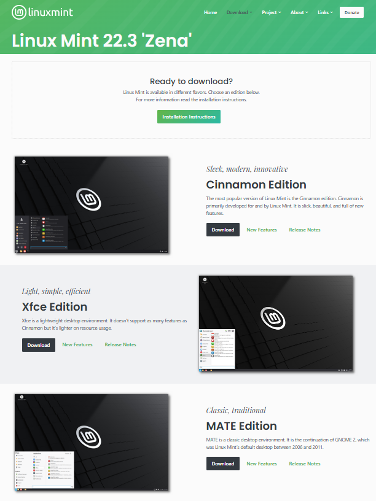

# How to Install Linux Mint on Windows

> First, back up your data on an external drive, since this operation will destroy all data on your internal drive

1. First, open your favorite web browser and go to [the Linux Mint Website](https://linuxmint.com/download.php).
2. Second, choose your edition. Cinnamon edition is sleek and modern, good for devices with 6 GB RAM or more. XFCE is for weaker hardware, good for devices with 4 GB RAM or less. MATE edition is for those who want a classic look to their OS or want a middle ground between Cinnamon and XFCE. 

3. Go down to the "Download Mirrors" section and click a link that is your country or has the same language. Wait for the ISO file to download.
4. Search the Microsoft Store for "Rufus"; download and open it.
5. Attach an external drive to your device and select it in the "Device" box

> **WARNING:** DO NOT select your internal drive or it will get wiped, making your computer useless.

6. Under "Boot Selection" , press "SELECT" and choose your ISO file in the downloads folder.
7. `(optional)` Name your external drive under the "Volume Label" section.
8. Press start, skim through the warnings, then wait for the process to complete.
9. Press the restart button on your PC(do not shut down because it won't work by default) and mash the BIOS button(F2 or del/backspace)
10. Don't be scared by the menu. Navigate to the security section and by "Secure Boot", select disable.
11. Save and exit. Then mash your boot menu button(F11, F12, etc.) and select your external drive.
12. If you get the error message, *mmx64.efi not found*(or similar), go to [boot] > EFI and copy grub64.efi and rename the copy to mmx64.efi. Repeat steps 9 and 11.
13. Double click the disk named "Install Linux Mint". Continue to press the continue button until you get to "Install Media Codecs". Check the checkbox and keep pressing "Continue".
14. Setup your username and password.
15. Once you complete the install wizard, look around Linux Mint while it downloads onto your internal drive. Try looking around the settings, that's really fun!